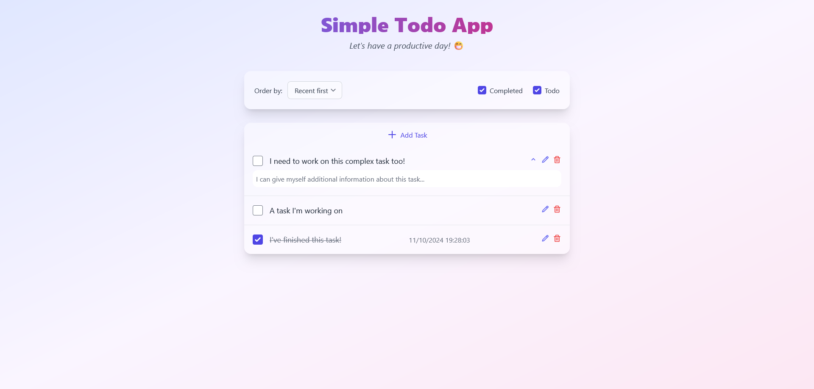

# NextJS ToDo App Frontend

This is a ToDo app frontend meant to be used with my todo app backend, available [here](https://github.com/Gratic/simple-todo-app).

This application features:
 * Creation of tasks with a title and an optional description;
 * Modification of tasks:
   * Easy modification of the title or description.
 * Simple checkmark to mark a task as complete or uncomplete;
 * Filtering tasks:
   * Archive the completed tasks quickly.
 * Order the task by creation date;
 * Save the date at which you completed task;
 * Easily delete tasks you made by error.

# Documentation

To start the application you can use docker or build it yourself.

## Pulling the image from Docker Hub

You can directly pull the image: `docker pull gratic/frontend-todo-app:0.3.0`.

And then create a container: `docker run gratic/frontend-todo-app:0.3.0 -e TASK_API_ENDPOINT=<task rest api url>`.

The application require access to the Task REST API.

## Building by yourself

### Building the application

This application was built with `Next.js 14.2.11` and `Node v20.16.0`.

First download dependencies: `npm ci`.
Then build the optimized application using: `npm run build`.

### Starting the application

Make sure the Task API endpoint is running and configured properly. See configuration below for more information.

After building the application, use: `npm run start`.

The application will listen on port `3000` by default. Use `npm run start -- -p <Your_Port>`

### Starting the dev server

The dev server requires the Task API endpoint to be working properly. See configuration below for more information.

Install dependencies: `npm ci`.

Run the development server using: `npm run dev`.

## Configuration

The file `.env.example` provide a template for configuration.

`TASK_API_ENDPOINT`: URL to the Task REST API endpoint. *Default to `http://localhost:8000/v1/tasks`*.